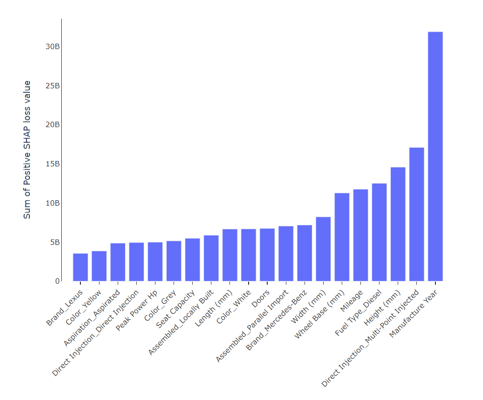
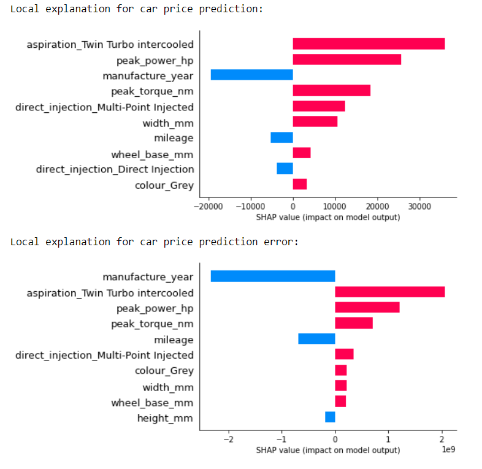

# FYP Project: Used Car Dealership Web Application

The project is an enhancement of existing used car dealership web application using online machine learning and interpertable machine learning. Below summarizes the important aspects of the web application. Please refer to the <a href="./reports/18ACB00224_FYP2.pdf">FYP 2 report</a> for the full details.

## Table of contents
- [Overview](#overview)
- [Features](#features)
- [Project demo](#project-demo)
- [File structure](#file-structure)
- [Acknowledgement](#acknowledgement)
- [Plagiarism check](#plagiarism-check)
- [Upcoming improvement](#upcoming-improvement)

## Overview

According to a research conducted by Brennen, most industry people or the end-user did not understand how AI works and did not trust them [1]. This discouraged the adoption of sophisticated AI applications like self-driving vehicles and financial robo-advisors in business. In the interviews conducted by Brennen, explainable AI could help the non-tech people to see values in AI and feel comfortable with AI without understanding how AI works [1]. Hence, I am motivated to implement explainable AI functionalities to promote application users' trust. In addition, I also need to implement mechanisms to monitor and detect drift to guarantee the relevancy of the machine learing models. Hence, the project objectives were:

1. To implement lead management that was enhanced with predictive analytics for spending less time and resources on converting leads.
2. To implement inventory management that was enhanced with predictive analytics for setting prices that were attractive and maximize profits.
3. To implement an online AI learning and monitoring system for automatically detecting and adapting to drift.
4. To implement explainable AI in predictive analytics for enhancing the business value of AI and promoting used car dealers’ trust in AI.

> [1] A. Brennen, "What Do People Really Want When They Say They Want
'Explainable AI?' We Asked 60 Stakeholders.," in Extended Abstracts of the 2020
CHI Conference on Human Factors in Computing Systems, Honolulu, HI, USA, Apr.
2020, pp. 1–7. doi: 10.1145/3334480.3383047.

## Features

### Interpretable machine learning

The method used to interpret the adaptive random forest is <a href="https://github.com/slundberg/shap">Tree SHAP (SHapley Additive exPlanations)</a>. <a href="https://plotly.com/python/">Plotly</a> is chosen for the visualizations since the plot can be configured in Python before converting to HTML and contains built-in functionalities such as image downloading, zooming, and data hovering with little or no configuration.

1. Beeswarm plots and feature importance bar plots are constructed to review car price model and lead scoring model.

> Beeswarm plot

> Feature importance bar plot

2. Positive and negative model loss bar plots are constructed to evaluate model's performance.

> Positive model loss bar plot

> Negative model loss bar plot

3. SHAP bar plots are constructed to review individual predicted car price/lead score.

> SHAP bar plot

4. SHAP bar plots and SHAP loss bar plots are constructed to review individual model loss.

> SHAP bar plot and SHAP loss bar plot

5. SHAP loss monitoring plots are constructed to monitor drift on records **with truth**.

> SHAP loss monitoring plot

6. PSI graphs, PSI tables and chisquared tables are constructed to monitor drift on records **without truth**. 

> PSI graph

> PSI table

> Chi-squared table

> PSI stands for Population Stability Index, while Chisquared stands for chi-squared goodness of fit tests.

### Online machine learning

The machine learning algorithms used are adaptive random forest (ARF) <a href="https://riverml.xyz/0.11.1/api/ensemble/AdaptiveRandomForestClassifier/">classification algorithm</a> and <a href="https://riverml.xyz/0.11.1/api/ensemble/AdaptiveRandomForestRegressor/">regression algorithm</a>. These algorithms can automatically start training new base learners (Hoeffding tree) in the background and eventually replace the corresponding old base learners if drift is detected. Instead of training ARF model from scratch, transfer learning is used to transfer training weights of a random forest model to an ARF model to give an initial performance boost. Then, verifications are conducted to ensure that:

1. The pre-trained ARF model's performance is at least good or better than the corresponding ARF model that is trained from scratch in both offline settings and online settings.
2. The performance of the pre-trained ARF model is at least good or better than random forest model in offline settings.
3. The performance of the ARF model was better than random forest model under the influence of drift.

> Models are trained with normal data in offline settings and trained with drifted data in onine settings.

> Verification of ARF classifier

> Verification of ARF regressor

Furthermore, since the Tree SHAP algorithm from the SHAP library does not directly support the ARF model from the River library, the weights must be manually extracted into a dictionary.

## Project demo
1. The FYP1 presentation video can be found at https://www.youtube.com/watch?v=coXsj8UFycY. FYP1 mainly focuses on theories and proposal.
2. The FYP2 presentation video can be found at https://www.youtube.com/watch?v=fdMzdLQ7_jc. FYP2 mainly focuses on implementation. 

## File structure
| Directory | Description |
| --- | --- |
| car-dealership-web-app | Contain the artifacts of ASP.NET Core 5 Web Application |
| car-dealership-web-service | Contain the artifacts of SHAP web service and River web service |
| jupyter_notebooks | Contain the details on model training and experimental results both in .ipynb format and .html format |
| pictures | Contain the screenshots of plagiarism result and other visualizations |
| reports | Contain the FYP II reports |
| web-service-test | Contain the test inputs of the web services |

## Acknowledgement
I would like to thanks Ts Sun Teik Heng @ San Teik Heng for patiently guiding the project.

## Plagiarism check
1. The image below shows the plagiarism result of the report. The full plagiarism result can be found inside the report.

## Upcoming improvement

Although this FYP project has been completed, I have realized that there are many design flaws in my system. I only knew when I have finished reading the book <a href="https://www.amazon.com/Building-Microservices-Designing-Fine-Grained-Systems/dp/1492034029">"Building Microservices"</a>, studied for the <a href="https://training.linuxfoundation.org/certification/kubernetes-cloud-native-associate">KCNA exam</a>, and research the latest AI practices from the book <a href="https://www.amazon.com/Designing-Machine-Learning-Systems-Production-Ready/dp/1098107969/">"Designing Machine Learning Systems"</a>. Due to time constraint, I am not managed to finish implementing this improved FYP project while currently studying other subjects. However, I will start implementing after the final examination is over. I will update the progress here when it is done.

1. 
<b>API design</b>: In microservice architecture, the SHAP web service and River web service should not be tightly coupled with one another. If not, the system cannot benefit from indepdent deployability, ease of change, and technology heterogeneity. Besides, the API interface must be redesigned to reduce the occurrence of breaking changes that affect API consumer. The API is described using OpenAPI specification (OAS) to automatically generate documentation using Swagger. The OAS file will be used by (1) <a href="https://stoplight.io/open-source/prism">Stoplight Prism</a> to create mock API server and used by (2) <a href="https://schemathesis.readthedocs.io/en/stable/">schemathesis</a> to automatically generate test cases. The purpose of these two tools is to thoroughly test the API before asking for QA approval using the <a href="https://www.jenkins.io/doc/book/pipeline/#overview">Jenkins pipeline</a>.

2. 
<b>Model serving library</b>: Replace the Flask-RESTful framework (traditional web server) with <a href="https://www.ray.io/ray-serve">Ray Serve</a>. Ray Serve framework can support complex model inference service using custom business logic and multiple ML models, and indenpendent scaling of each model.

3. 
<b>Kubernetes</b>: Instead of using Docker compose, Kubernetes is used instead to deploy the containers. It is because Kubernetes controllers and operators (custom controllers) can support various production use cases like service discovery, load balancing, failover, rollouts, rollbacks, observability, continuous delivery, and more without relying on manual set up nor vendor-specific cloud services. Besides, service mesh like <a href="https://linkerd.io/">Linkerd</a>, distributed streaming system like <a href="https://kafka.apache.org/">Apache Kafka</a>, and GitOps continuous delivery tool like <a href="https://argo-cd.readthedocs.io/en/stable/">Argo CD</a> can also be easily deployed along with the containers using a simple "helm install" command. Finally, these are all packaged with the web services using Helm charts to facilitate easy versioning and installation on any Kubernetes cluster.

4. 
<b>API & microservice security</b>: I am also going to implement API security, currently I haven't finish reading the <a href="https://www.amazon.com/Microservices-Security-Action-Prabath-Siriwardena/dp/1617295957">"Microservices Security in Action"</a>. Hence, I haven't have the full knowlege on how to implement the security mechanism. I will update after final examination is over.

